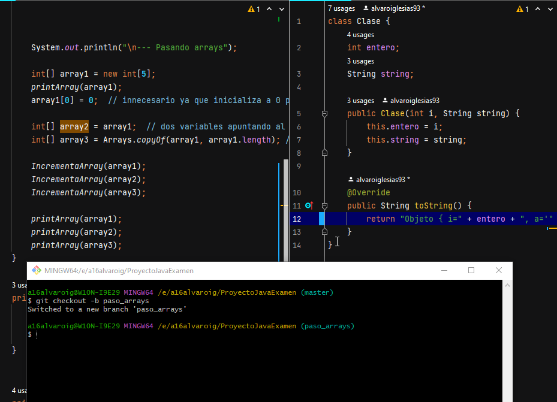

 

Creacion de un proyecto de IntelliJ con repositorio Git y código de ejemplo.

Primer commit en master.

Creamos y desarrollamos la rama valor_referencia.

Hacemos un push de la rama valor_referencia.

Hacemos un merge de esta rama a master.

Hacemos un merge de esta rama a master.

Hacemos un merge a master.

Creamos las ramas comparando_objetos y comparando_strings y las desarrollamos.

Se han cometido algunos errores aqui. Es posible que haya mergeado antes de tiempo...

Hacemos merge de ambas a master, solventando el conflicto.

NO parece que haya conflictos

Realizamos una corrección menor en valor_referencia y la hacemos un merge a master.

Creamos readme y se sube master al repo

